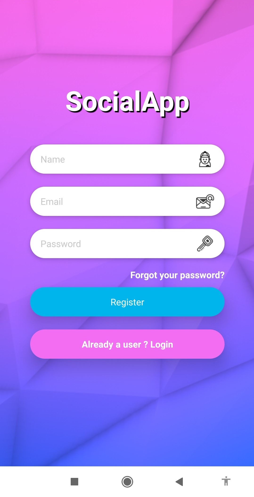
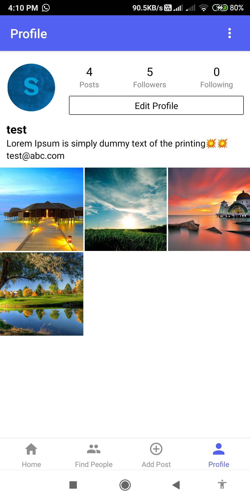
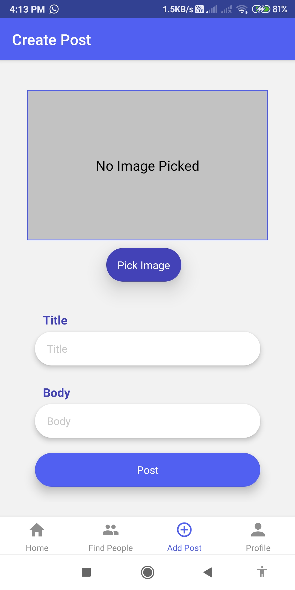

 

# SocialApp-React-Native

Social Networking mobile app similar to Instagram in React Native.
This is a mobile version of the [Socail Web APP](https://github.com/allpyjs/Social-WebAPP-MERN) app built with React Native, TypeScript, Firebase, and NativeWind (Tailwind CSS) for styling. 

## Preview

<h4 align="center">Signup Screen &nbsp&nbsp&nbsp&nbsp | &nbsp&nbsp&nbsp&nbsp Home Screen &nbsp&nbsp&nbsp&nbsp | &nbsp&nbsp&nbsp&nbsp Profile Screen</h4>

<h4 align="center">User Posts Screen &nbsp&nbsp&nbsp&nbsp | &nbsp&nbsp&nbsp&nbsp User Stats Screen &nbsp&nbsp&nbsp&nbsp | &nbsp&nbsp&nbsp&nbsp Find People Screen</h4>

<h4 align="center">User Chats List Screen &nbsp&nbsp&nbsp&nbsp | &nbsp&nbsp&nbsp&nbsp Chat Screen &nbsp&nbsp&nbsp&nbsp | &nbsp&nbsp&nbsp&nbsp Comments Screen</h4>

<h4 align="center">Create Post Screen &nbsp&nbsp&nbsp&nbsp | &nbsp&nbsp&nbsp&nbsp Notification on new message</h4>

## Run project locally

* clone this Repository by `git clone https://github.com/allpyjs/Social-Mobile-App-ReactNative-Firebase.git`.
* Change directory `cd SocialApp-React-Native`
* Make sure you have expo-cli installed. If not run `npm install -g expo-cli`
* Install the dependencies using `npm install`
* Run `npm start`
* Then type in terminal `a` to run on android emulator, `i` to run on ios simulator.
